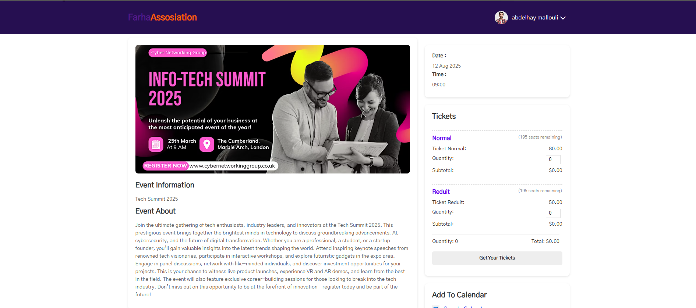
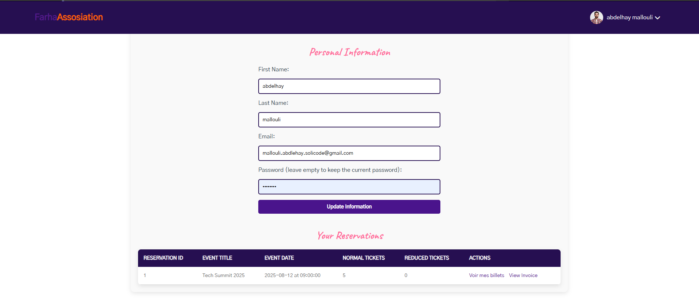

# Event Management for Association FARHA


## Description
This project is a PHP-based web application designed to manage event reservations for the "Association FARHA." It allows users to browse, filter, and book event tickets while managing their profiles.

## Features
- **Event Listing**: Users can search and filter events.
- **Event Details & Booking System**: Detailed event pages with ticket purchasing options.
- **User Authentication**: Registration and login system.
- **User Profile Management**: View and edit personal details, purchase history.
- **Ticket & Invoice Management**: Users can view tickets and invoices.

## Technologies Used
- **Frontend**: HTML, CSS, JavaScript
- **Backend**: PHP
- **Database**: MySQL (MariaDB in XAMPP)
- **Version Control**: Git & GitHub

## Project Structure
```
/event-management/
│── index.php          # Home page (Event listing, search & filters)
│── event.php          # Event details & ticket purchase
│── login.php          # User login page
│── sign-up.php       # User registration page
│── profile.php        # User profile & purchase history
│── purchase.php       # Ticket purchase processing
│── confirmation.php   # Purchase confirmation page
│── logout.php         # User logout
│── config.php             # Database connection
│── css/style.css          # CSS styles
│── scripts.js         # JavaScript functions
│── /images/           # Event images
```

## Installation & Setup
1. Clone the repository:
   ```bash
   git clone https://github.com/abdelhaymallouli/Event-management-of-a-cultural-association.git
   ```
2. Start a local server (XAMPP recommended) and create a MySQL database named `farhaevents`.
3. Import the provided SQL file into MySQL.
4. Configure the database connection in `config.php`.
5. Run the project by opening `index.php` in a web browser.

## Screenshots





## Contributing
Feel free to submit issues and pull requests to improve the project.


