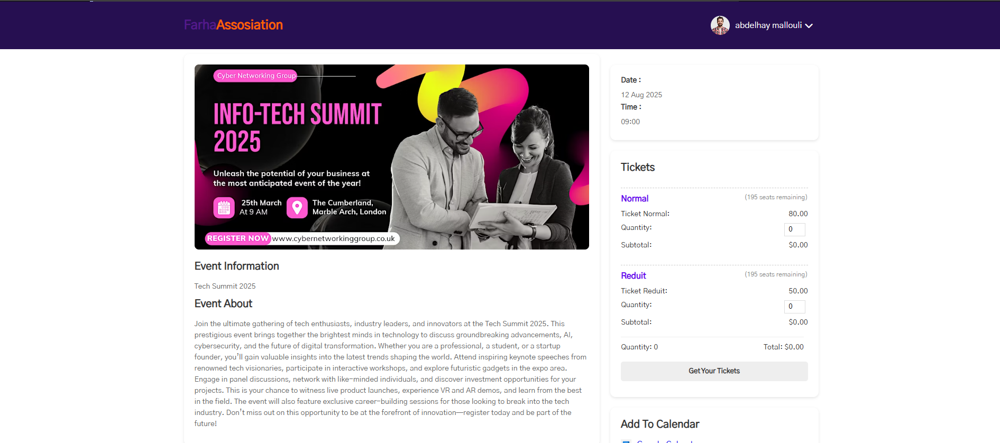
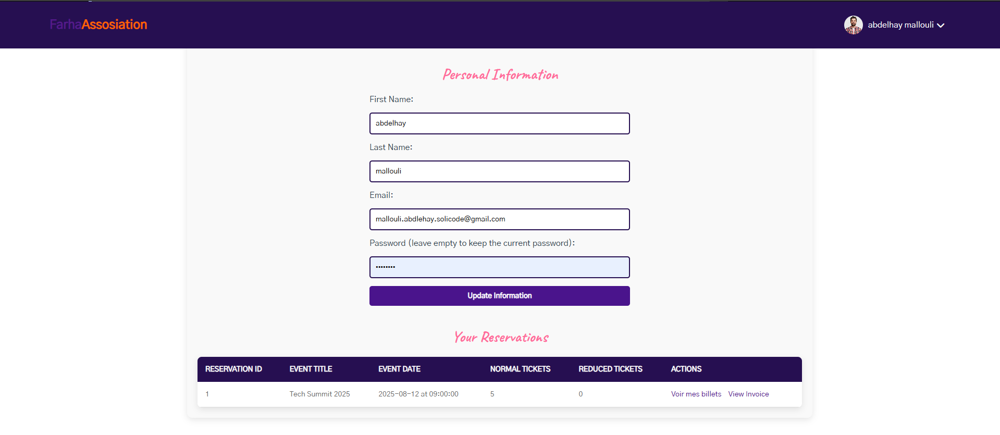

# Event Management System - Association FARHA


## 📌 Project Overview

This project is a comprehensive **Event Management Web Application** developed for "Association FARHA". It is designed to streamline the process of managing cultural events, booking tickets, and handling user reservations. The platform provides a seamless experience for both administrators and regular users to explore upcoming events, purchase tickets, and manage their activities.


## 🚀 Features

### for Users:

- **Event Discovery:** Browse a catalog of upcoming cultural events (Music, Theater, Cinema, etc.).
- **Advanced Filtering:** Search events by name, date range, or category.
- **Detailed Event Pages:** View rich descriptions, images, prices, and venue information.
- **Ticket Booking:** Securely book Regular or Reduced tariff tickets.
- **User Dashboard:**
  - **Profile Management:** Update personal information.
  - **Ticket Wallet:** View purchased tickets with QR codes/IDs.
  - **Invoices:** Download invoices for past purchases.

### Additional Features:

- **Responsive Design:** Optimized for desktop and mobile viewing.
- **Real-time Availability:** Automatic calculation of remaining seats.
- **Secure Authentication:** User registration and login system.

## 🛠️ Technology Stack

- **Frontend:**
  - HTML5 & CSS3 (Custom styling)
  - JavaScript (Client-side validation and interactivity)
- **Backend:**
  - PHP 8+ (Core logic)
  - PDO (Database abstraction layer)
- **Database:**
  - MySQL / MariaDB (Relational database management)
- **Server:**
  - Apache (XAMPP/WAMP recommended)

## 📂 Project Structure

```bash
/Event-management-of-a-cultural-association
│
├── config.php          # Database connection configuration
├── index.php           # Landing page with event listing and filters
├── event.php           # Individual event detailed view
├── login.php           # User authentication (Login)
├── sign-up.php         # User registration
├── logout.php          # Session termination
├── profile.php         # User dashboard (Tickets, Invoices, Settings)
├── purchase.php        # Ticket purchase logic
├── confirmation.php    # Booking success page
├── invoice.php         # Generates printable invoices
├── ticket.php          # Visual ticket view
│
├── css/
│   └── style.css       # Main stylesheet
│
├── img/                # Assets and icons
├── screenshots/        # Project preview images
│
└── farhaevents.sql     # Database import file
```

## ⚙️ Installation & Setup Guide

Follow these steps to set up the project locally:

### 1. Prerequisites

- **XAMPP** (or any PHP/MySQL local server environment).
- A web browser.

### 2. Database Setup

1. Open **phpMyAdmin** (usually at `http://localhost/phpmyadmin`).
2. Create a new database named `farhaevents`.
3. Click on **Import**.
4. Choose the `farhaevents.sql` file located in the project root directory.
5. Click **Go** to import the schema and seed data.

### 3. Application Configuration

1. Open `config.php` in your code editor.
2. Verify the database credentials match your local setup:
   ```php
   $host = 'localhost';
   $dbname = 'farhaevents';
   $username = 'root'; // Default for XAMPP
   $password = '';     // Default for XAMPP
   ```

### 4. Running the Application

1. Move the project folder to your server's root directory (e.g., `C:\xampp\htdocs\`).
2. Open your browser and navigate to:
   `http://localhost/Event-management-of-a-cultural-association/`

## ❓ Troubleshooting

### "Events are not showing up on the home page!"

The system is designed to show **Upcoming Events** only (`WHERE dateEvent >= CURDATE()`).

- Unless you have modified the database, the sample data includes events from **2025**.
- If you are running this in 2026 or later, **all seed events are in the past**.
- **Fix:**
  1. Open `index.php`.
  2. Modify the query to remove the date filter for testing purposes, or
  3. Manually update the `dateEvent` in your database to future dates.

### Database Connection Error

- Ensure MySQL is running in XAMPP control panel.
- Check if the `$dbname` in `config.php` matches exactly with the database name you created.

## 📸 Screenshots

### Event Details



### User Profile



---

_Created by Abdelhay Mallouli_
